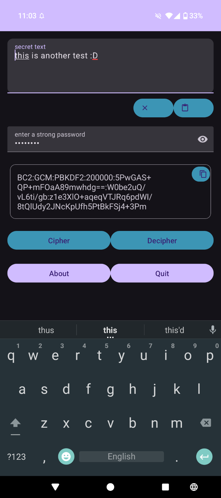
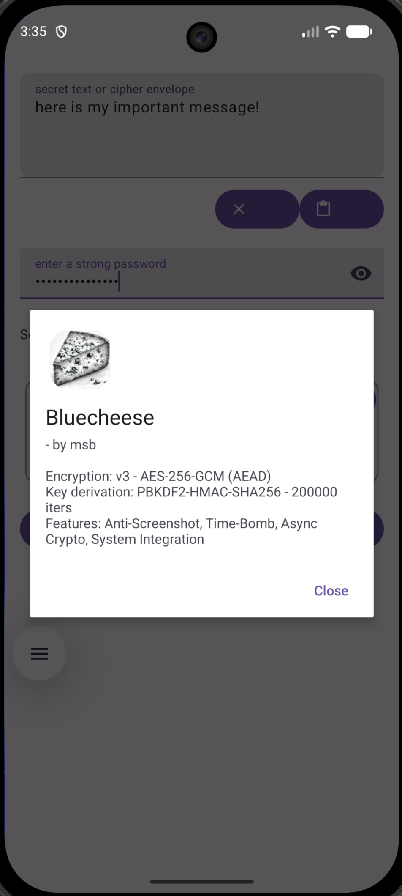

# Bluecheese

A fast, privacy-friendly App for text encryption.

## Screenshots

  
  

## Features

- Clean and intuitive UI
- Works offline
- 100% open source

## Encryption Algorithm

At the moment the program uses AES-128 in CBC mode with PKCS#5 padding.

Please note that, the present version provides confidentiality but not authenticity.

In future updates, I will surely expand to more robust and strong encryption algorithm.

## Contribute

Issues and pull requests are welcome. Please open an issue to discuss significant changes.

## License

Distributed under the GPL License. See LICENSE for details.

