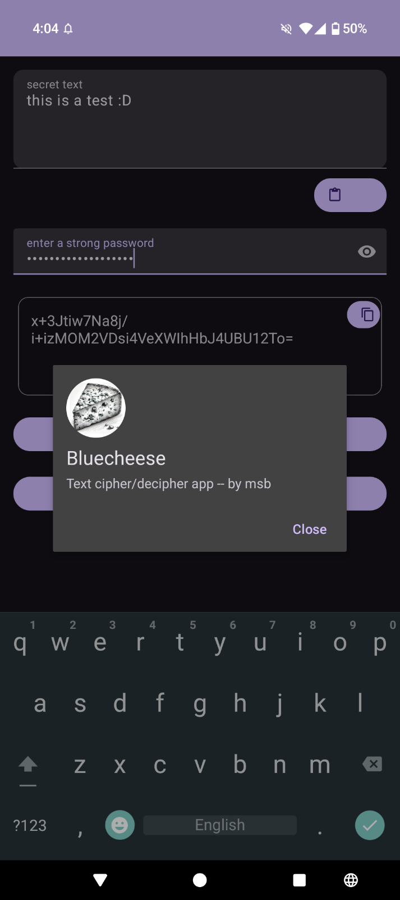
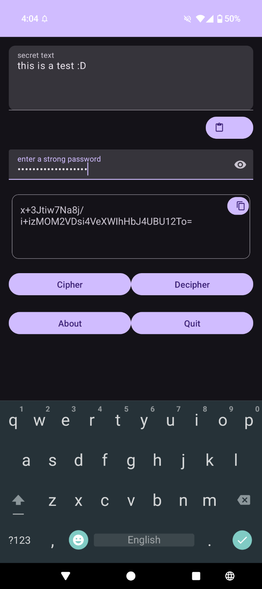

# Bluecheese

A fast, privacy-friendly App for text encryption.  

## Screenshots

## Features

- Clean and intuitive UI
- Works offline
- 100% open source

## Contribute

Issues and pull requests are welcome. Please open an issue to discuss significant changes.

## License

Distributed under the GPL License. See LICENSE for details.

